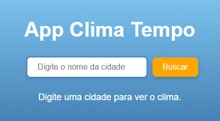
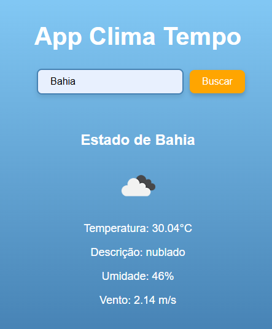

# App Clima Tempo 🌦️

Bem-vindo ao **App Clima Tempo**! Este é um aplicativo interativo e responsivo que exibe informações meteorológicas em tempo real, utilizando a API da OpenWeatherMap. O projeto foi desenvolvido com **ReactJS** e destaca habilidades em desenvolvimento frontend, consumo de APIs e design responsivo.

## 🛠️ Funcionalidades Principais

- **Busca por Cidade:** Digite o nome de uma cidade para visualizar o clima atual.
- **Informações Meteorológicas:** Exibe temperatura, descrição do clima, umidade e velocidade do vento.
- **Ícones Representativos:** Ícones visuais são exibidos para ilustrar as condições climáticas.
- **Design Responsivo:** Compatível com diferentes tamanhos de tela, incluindo dispositivos móveis e desktops.

## 🚀 Tecnologias Utilizadas

- **ReactJS:** Biblioteca principal para construção da interface do usuário.
- **CSS3:** Para estilização responsiva e moderna.
- **OpenWeatherMap API:** Fornece dados meteorológicos em tempo real.
- **Create React App:** Configuração inicial do projeto.

## 🖥️ Pré-requisitos

Antes de começar, certifique-se de ter o **Node.js** instalado em sua máquina.

## 🚧 Como Rodar o Projeto

Siga os passos abaixo para executar o aplicativo localmente:

1. **Clone o repositório:**
   ```bash
   git clone https://github.com/seu-usuario/app-clima-tempo.git
   ```
2. **Navegue até o diretório do projeto:**
   ```bash
   cd app-clima-tempo
   ```
3. **Instale as dependências:**
   ```bash
   npm install
   ```
4. **Inicie o aplicativo:**
   ```bash
   npm start
   ```
5. **Abra o navegador e acesse:**
   ```
   http://localhost:3000
   ```

## 🧩 Como Configurar a API

1. Crie uma conta gratuita no [OpenWeatherMap](https://openweathermap.org/).
2. Obtenha sua **API Key**.
3. Substitua `"SUA_API_KEY"` no arquivo `App.js` pela sua chave:
   ```javascript
   const apiKey = "SUA_API_KEY";
   ```

## 🖌️ Estilo do Projeto

O aplicativo apresenta:

- Gradiente suave no fundo para representar o céu.
- Input e botão estilizados com bordas arredondadas e efeitos `hover`.
- Ícones do clima representando o estado atual, integrados pela API.

## 📸 Capturas de Tela

### Tela Inicial:


### Tela Após a Busca:


## 📚 Lições Aprendidas

Durante o desenvolvimento deste projeto, aprofundei meu conhecimento em:

- Integração com APIs externas e tratamento de erros.
- Gerenciamento de estado no React.
- Melhores práticas para criar uma interface responsiva e atraente.

## 🤝 Contribuição

Sinta-se à vontade para sugerir melhorias ou relatar problemas no projeto abrindo uma [issue](https://github.com/seu-usuario/app-clima-tempo/issues).



-Tela após a busca:

